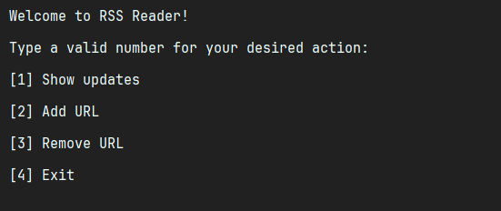
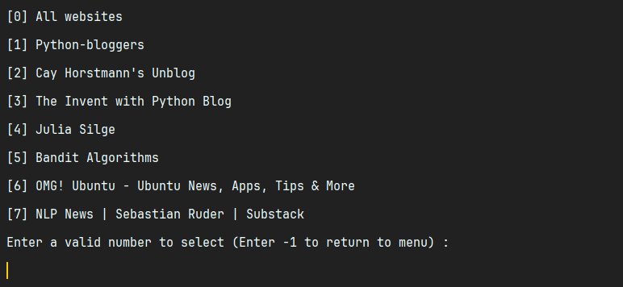
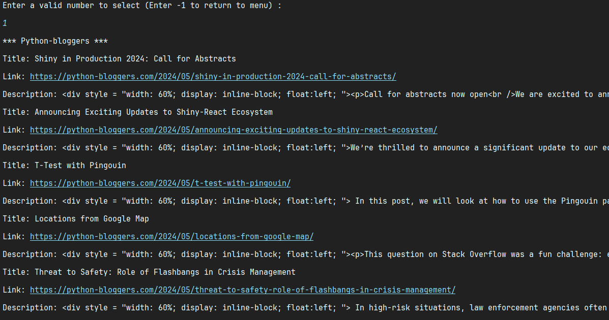

# JavaRSSReader

JavaRSSReader is a Java-based command-line application that allows users to read and manage RSS feed URLs conveniently.

## Features

- **Show Updates**: View the latest updates from subscribed RSS feeds.
- **Add URL**: Add a new RSS feed URL to the list of subscriptions.
- **Remove URL**: Remove an existing RSS feed URL from the list of subscriptions.

## Prerequisites

- Java Development Kit (JDK) 8 or higher

## Libraries Used

- **Jsoup (version 1.17.2)**: Jsoup is a Java library for working with real-world HTML. It provides a convenient API for extracting and manipulating data from HTML documents. Jsoup is used in this project to parse HTML pages and extract information such as page titles and RSS feed URLs.

## Getting Started

### Running the Application

1. **Clone the repository:**

    ```sh
    git clone https://github.com/ykazemim/JavaRSSReader.git
    cd RSSReader/src
    ```

2. **Add Jsoup Library:**

This project relies on the Jsoup library for HTML parsing. You need to add Jsoup to your project's dependencies. You can download Jsoup from the [offical site](https://jsoup.org/download "Download Jsoup Library")
or add it using a build tool like Maven or Gradle.


3. **Compile and run the application:**

    ```sh
    javac Main.java
    java Main
    ```

## Usage

- **Show Updates**: Choose option [1] to display the latest updates from subscribed RSS feeds.
- **Add URL**: Choose option [2] to add a new RSS feed URL to your subscriptions. You will be prompted to enter the URL.
- **Remove URL**: Choose option [3] to remove an existing RSS feed URL from your subscriptions. You will be prompted to enter the index of the URL to remove.
- **Exit**: Choose option [4] to exit the application.

## Screenshots
- Main Menu of the app



- Show updates option



- Fetching information from the desired RSS feed



## Assignment

This project was originally created as an assignment for the Advanced Programming course at _Amirkabir University of Technology (AUT)_.
